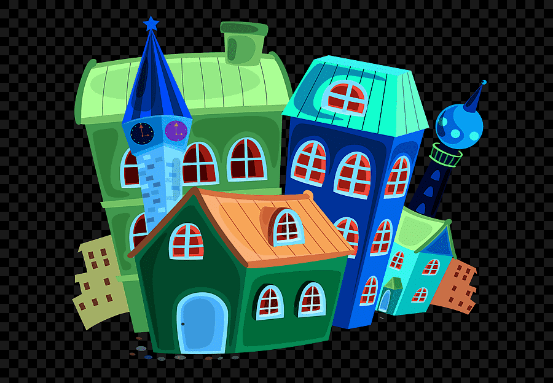

# image-processing-serverless-lambda-aws

La lambda en este repositorio esta construida para procesar imagenes cada vez que se agrega un objecto "imagen" en el bucket S3.

Existe una clase la cual ya tiene definido 4 metodos para realizar operaciones sobre la misma mediante un parametro que se toma desde la variable de entorno de la lambda.

## Muestra de una imagen original

## Muestra de los posibles filtros a aplicar sobre la imagene:

## Poner Todo en marcha:

#### Lo primero es tener creada una politica para su lambda y que esta pueda acceder a los servicios de AWS sin ningun problema.

Vaya al servicio de IAM y cree un role con el siguiente nombre: [processing-image-lambda-role] y las siguientes  politicas ya predefinidas: [AmazonS3FullAccess, AWSOpsWorksCloudWatchLogs].

#### Lo segundo seria crear dos bucket de S3 con los siguientes  nombres: [image-processing, image-processing-output].

Le puede colocar cualquier nombre si los que definimos arriba ya existe, lo importante aqui es mantener los nombres iguales para los dos bucket con la diferencia que el bucket de salida  le tendria que agrega la palabra output al final.

#### Lo ultimo es crear la lambda, cuando cree la lambda no olvide agregar la politica anteriormente creada.

Estando la lambda ya creada, agrega una variable de entorno con el siguiente nombre: `[typeProcessing]`.

Ese nombre es utilizado por la lambda para saber que tipo de filtro aplicar, estos son los posibles valores que ustedes puede probar y colocar en la variable de entorno creada: `[greyscale, tinte, negate, blur]`.

Luego de eso, en la sección de configuración, agrega un trigger, seleccione el servico de S3, seleccione el bucket de entrada y en el tipo de evento seleccione `[All Object Create events]`.

Con esto seria suficiente para tener su ambiente de AWS listo para probar la lambda.

Cuando descargue este codigo instale las dependencias con el siguiente comando:

> npm install

Luego de eso, comprima su lambda en un zip, subado a su cuenta de AWS y cargue una imagen en el bucket en entrada, se deberia disparar la lambda para procesar la imagen recien subida, para verificar vaya a su bucket de salida (output) y deberia ver la imagen ya transformada.

Y eso seria todo.

